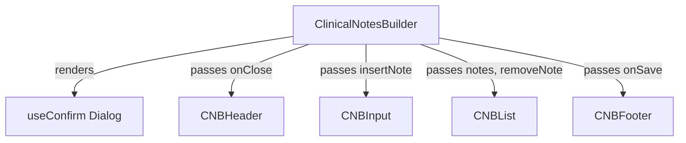

# ClinicalNotesBuilder

## Overview
The `ClinicalNotesBuilder` is a modular, React-based feature component designed for constructing and managing structured clinical observations. It presents a modal interface where users can input clinical notes comprised of a category (e.g., "Diabetes"), observation details, and an optional "critical" severity flag. The component handles insertion logic, duplicate category detection with a replacement confirmation dialog, note removal, and guards against discarding unsaved changes.

## Component Architecture

The feature is composed of a main stateful container and several stateless presentational child components. 

*   **`ClinicalNotesBuilder` (`index.tsx`)**: The root container and state manager. It maintains the `notes` state, handles keyboard interactions (Escape to close), orchestrates duplicate detection using a custom `useConfirm` hook, and guards unsaved changes via `window.confirm`.
*   **`CNBHeader`**: A presentational component rendering the modal title, icon, and close button, triggering the `onClose` callback.
*   **`CNBInput`**: A controlled form component managing the local state of a new note being drafted. It provides inputs for category and observation, a toggle for the `isCritical` flag, and triggers the `insertNote` function.
*   **`CNBList`**: A presentational list component that renders the current clinical notes. It visually distinguishes critical notes and provides a deletion interface for each item via the `removeNote` callback.
*   **`CNBFooter`**: Renders the final call-to-action "Save Details" button, triggering the `onSave` callback to propagate the accumulated notes to the parent.

### Component Tree

## State Management & Data Flow

The `ClinicalNotesBuilder` acts as a controlled container, managing the list of notes while delegating UI rendering to functional sub-components.

### Source of Truth
The central source of truth for the current session lives in the local `notes` state within `ClinicalNotesBuilder`, initialized by the `initialNotes` prop. A transient `newNote` state resides inside `CNBInput` to handle active typing before a note is committed to the main array.

### Component Data Flow
Data flows strictly downwards from the parent container to its children:
* **`ClinicalNotesBuilder` (Parent):** Orchestrates state and passes down callbacks.
* **`CNBInput`:** Receives the `insertNote` asynchronous callback. Manages individual inputs and surfaces fully formed `ClinicalNote` objects.
* **`CNBList`:** Receives the mapped/sorted `notes` array and a `removeNote` callback to delete notes by `category`.
* **`CNBFooter` & `CNBHeader`:** Receive `handleSave` and `onClose` respectively to flush state upwards or abort.

### Key Patterns

* **Input Validation & Sanitization:** Input text is defensively filtered at keystroke-level via `filterAlphabetsAndNormalizeSpaces` (for categories) and `filterAlphaNumeric` (for observations). Final submission capitalizes words automatically via `deepCapitalizeWords`.
* **Duplicate Collision Handling:** If an incoming note's category matches an existing one (case-insensitive), the component pauses execution and prompts the user with a `useConfirm` ("destructive") dialog. It updates the existing entry if confirmed, or aborts otherwise.
* **Dirty State Protection:** `lodash.isequal` compares current `notes` against `initialNotes`. If changes are detected during an exit attempt (either via the "Close" button or `Escape` key), a `window.confirm` warns against accidental data loss before discarding changes.
* **Sorting Policy:** The `notes` array is dynamically sorted before rendering via `sortNotes`, ensuring that notes flagged as `isCritical` always bubble up to the top of `CNBList`.

## Key Architectural Decisions

- **State Management (Hoisted vs. Local)**: 
  - The main `notes` collection is managed as local state in the `ClinicalNotesBuilder` wrapper, seeded by the `initialNotes` prop and emitted outward only when finalized via `onSave`. 
  - `CNBInput` isolates its own transient local state for draft notes, cleanly decoupling the input-in-progress from the committed `notes` list.
- **Component Composition**: The feature is split into strict functional components (`CNBHeader`, `CNBFooter`, `CNBList`) and state-handling mechanisms (`CNBInput`), all orchestrated by the parent container rendering as a modal dialog overlay.
- **Data Normalization & Sanitization**: 
  - Real-time input filtering restricts characters as the user types: `filterAlphabetsAndNormalizeSpaces` for categories and `filterAlphaNumeric` for observations.
  - Committing a note normalizes it via `deepCapitalizeWords`. Category uniqueness validation strictly applies case-insensitive matching.
- **Dependencies**: Relies heavily on `lodash.isequal` for deep array comparisons, `lucide-react` for standard UI iconography, and an async `useConfirm` hook to orchestrate non-blocking confirmation dialogs.

## Edge Cases & Nuances

- **Unsaved Changes Protection**: Attempting to close the modal (via the `X` button or the global `Escape` key listener) runs a deep comparison against `initialNotes`. Modifying the state triggers a native `window.confirm` to block accidental data loss.
- **Duplicate Category Override**: Inputting an existing category (checked case-insensitively) intercepts the insertion with an asynchronous `useConfirm` alert, requiring user consent before mutating the existing record.
- **Keyboard Shortcuts**: 
  - A global `keydown` event listener is mounted to trap the `Escape` key, triggering the standard close flow.
  - Pressing `Enter` within the observation input immediately triggers `handleAddNote`.
- **Dynamic Auto-sorting**: The rendered note list dynamically sorts items via `sortNotes` (`+n2.isCritical - +n1.isCritical`), ensuring that notes flagged as critical always hoist to the top of the view.
- **Responsive Visibility Hacks**: The `Trash2Icon` delete button relies on responsive hover utility classes (`opacity-100 lg:opacity-0 lg:group-hover:opacity-100`). It is persistently visible on mobile/touch devices but only reveals on hover in desktop viewports.
- **Empty States**: Intentionally renders a dashed, italicized placeholder block when `notes.length === 0` to prevent the UI from collapsing ungracefully.
