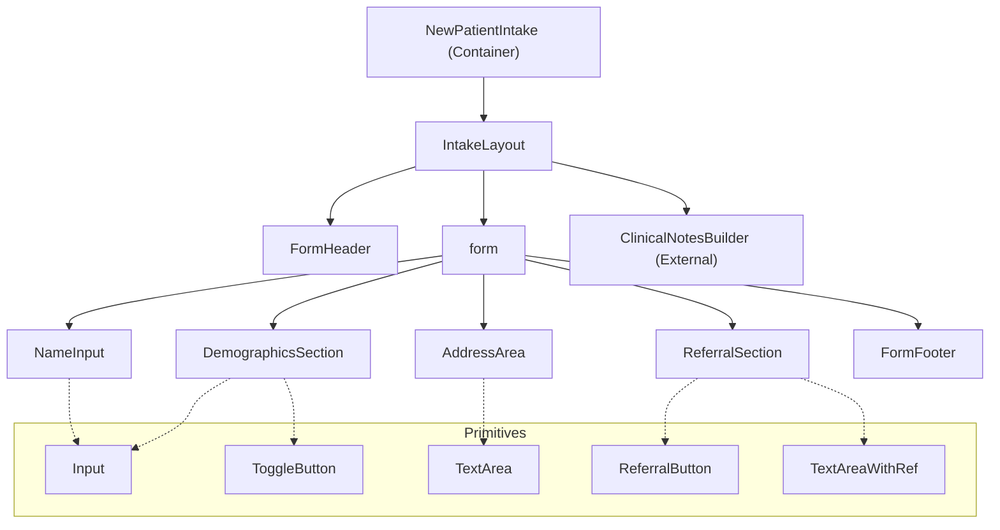

# New Patient Intake Form

## Title & Overview

The `NewPatientIntake` feature provides a centralized registration interface for onboarding new patients. It captures essential data including legal name, vital demographics, contact information, and referral origins. State management is handled internally via a `useReducer` pattern mapped to strongly-typed actions, incorporating automatic data normalization and rigorous form validation prior to submission. Additionally, it conditionally mounts a `ClinicalNotesBuilder` to append initial clinical observations during the intake process.

## Component Architecture

The architecture follows a container-presenter pattern, with `NewPatientIntake` acting as the stateful orchestrator and a suite of modular sub-components handling specific form segments.

### Key Components

- **`NewPatientIntake` (`index.tsx`)**: The root stateful container. Manages the `FormData` state, executes validation/normalization logic, and controls the visibility of the clinical notes modal.
- **`FormHeader` & `FormFooter`**: Presentational boundaries handling title display and global actions (Submit, Cancel, Add Notes).
- **`DemographicsSection`**: Encapsulates inputs for mobile (with formatting), age, and sex (using segmented toggles).
- **`ReferralSection`**: Manages referral source selection, featuring reactive UI that auto-focuses and reveals a `TextAreaWithRef` when "Dr. Referral" is selected.
- **Primitives (`primitives.tsx`)**: A shared library of base components (e.g., `Input`, `ToggleButton`, `IntakeLayout`) that abstract away Tailwind utility classes and DOM forwarding logic.

### Component Tree

## State Management & Data Flow

### Single Source of Truth
The `NewPatientIntake` root component acts as the single source of truth for the intake form. All form state is managed centrally via React's built-in `useReducer` hook without relying on external form libraries (e.g., React Hook Form or Formik). 

### Controlled Components & Data Flow
Data flows purely top-down. The root component passes specific state slices and dispatch-bound callback functions down to highly modular, purely controlled child components:
* `NameInput`
* `DemographicsSection`
* `AddressArea`
* `ReferralSection`

Child components are entirely stateless regarding form data; they strictly receive their values via props and report changes back up to the reducer through their specific action callbacks (e.g., `changeAge`, `changeReferral`).

### State Normalization & Validation
* **Inline Normalization**: The `formReducer` immediately applies input filters and normalizers during state transitions (e.g., `filterAge`, `filterPhoneNumber`, `validateAndCapitalizeName`). This ensures invalid characters are intercepted and blocked before entering the component state.
* **Synchronous Validation on Submit**: When the form is submitted, a `validateFormData` helper synchronously audits the complete `formData` payload against business rules (e.g., field lengths, valid age bounds, and conditionally required fields like `doctorInfo` for doctor referrals).
* **Error Handling**: If validation fails, error messages are aggregated into an array of strings and immediately surfaced to the user via a blocking, native browser `alert()`.

### Submission Pattern
Upon successful validation, a `deepTrimStrings` utility sanitizes the final payload to eliminate excess whitespace. The resulting validated and trimmed state is then surfaced via the `onSubmit` callback for external consumption, and the internal reducer resets to its initial state via the `RESET` action.

## Key Architectural Decisions

*   **State Management via Reducer**: Complex form state relies on a single `useReducer` instead of multiple `useState` hooks. The `formReducer` bakes real-time input sanitization (`filterPhoneNumber`, `normalizeAddress`, `filterAge`) directly into state transitions, ensuring data cleanliness at the source.
*   **Dynamic State Omission**: The reducer aggressively drops irrelevant state on transitions. When toggling the referral type away from `DOCTOR`, the `doctorInfo` key is deliberately destructured out of the state payload.
*   **Component Modularity & Primitives**: The form is decoupled into feature-specific sections (`DemographicsSection`, `ReferralSection`). Styling logic is extracted into `styles.tsx`, mapping tailwind classes to reusable generic UI primitives (`Input`, `ToggleButton`, `TextAreaWithRef`) to maintain design consistency.
*   **Centralized Validation Strategy**: Form submission utilizes a single `validateFormData` pure function to aggregate errors prior to deep-trimming the payload, working in tandem with inline HTML5 constraints (`required`, `pattern`).

## Edge Cases & Nuances

*   **Conditional Auto-Focus**: In `ReferralSection.tsx`, a `useEffect` hook tied to a `ref` immediately auto-focuses the "Doctor's Info" `TextAreaWithRef` when the `DOCTOR` referral option is selected, smoothing out keyboard navigation.
*   **Strict Name Hydration & Formatting**: Both the `initialName` prop (via `useReducer` lazy initialization) and subsequent inputs are rigorously processed by `validateAndCapitalizeName` to strip non-alphabet characters and enforce Title Case formatting.
*   **Mobile-Optimized Input Attributes**: The Age input sets `type="number"`, `pattern="[0-9]*"`, and `maxLength={2}` to force numeric keypads on iOS/Android. Phone fields utilize `type="tel"` and visually mask values via `formatPhone` while persisting filtered numeric strings.
*   **Clinical Notes Mount Cycle Quirks**: There is a documented `HACK` regarding the `ClinicalNotesBuilder` overlay. Because it takes `formData.clinicalNotes` as an `initialNotes` prop on mount and manages its own internal state, modifying the parent form state while it's mounted will not propagate. Updates only sync via the `onSave` callback.
*   **Accessibility Tab Flow Adjustments**: The "Add additional details" button (`NotebookPenIcon`) in the footer intentionally sets `tabIndex={-1}`. This explicitly removes it from the primary keyboard focus flow, preventing interruption to the tab sequence right before the submission/cancellation actions.
