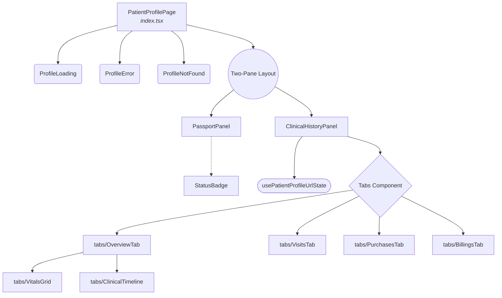

# Patient Profile Dashboard

## Title & Overview

The Patient Profile feature is a comprehensive, mobile-responsive dashboard designed to aggregate and display a patient's core demographic details alongside their complete medical and financial history. It employs a two-pane layout: a persistent identity "Passport" and a tabbed "Clinical History" view. The module includes robust state handling (loading, error boundaries, and "not found" states), custom hook-driven URL state management for deep-linking tabs, and gracefully degrades to a panel-switching interface on smaller viewports. 

## Component Architecture

The architecture heavily favors composition, separating data-fetching and state management at the root level from the presentational UI panels. 

- **`PatientProfilePage` (`index.tsx`)**: The root container. It manages the asynchronous retrieval of patient data (including error simulation for resilience), URL parameters, and layout state. It handles conditional rendering for `ProfileLoading`, `ProfileError`, and `ProfileNotFound` before delegating data to the main panels.
- **`PassportPanel`**: A static, high-visibility identity card. It displays vital demographic data, an avatar fallback, critical medical alerts mapped to specific badge variants (e.g., DNR, Allergy), and core identifiers (MRN, Blood Type, Insurer).
- **`ClinicalHistoryPanel`**: The core interactive workspace. It uses a tabbed interface synced with the browser's URL (via `usePatientProfileUrlState`) to persist the user's active view.
  - **`OverviewTab`**: Presents high-level clinical summaries via the `VitalsGrid` and `ClinicalTimeline` components.
  - **`VisitsTab`**: Renders comprehensive logs of clinical visits and complaint courses.
  - **`PurchasesTab`**: Displays a history of medical or retail purchases.
  - **`BillingsTab`**: Tracks the patient's financial history and invoice ledger.

### Component Tree

## State Management & Data Flow

### UI & URL State (Source of Truth)
State for the Patient Profile dashboard is divided between local component state and the URL:
- **Responsive Layout State**: Mobile view toggling between the `profile` (Passport) and `history` (Clinical Panel) is managed via standard `useState` local component state.
- **Dashboard Tabs & Filters**: The definitive source of truth for the active history tab and internal filters resides in the **URL search parameters** (e.g., `?tab=visits&type=CONSULTATION`). This ensures deep linkability and state persistence across browser reloads.

**URL Synchronization (`usePatientProfileUrlState`)**:
To manage this state, the feature utilizes a centralized hook `usePatientProfileUrlState` which abstracts `useSearchParams` from `react-router-dom`:
- **Type-safe Getters:** Extracts raw URL parameters and routes them through custom runtime type guards (`isValidTab`, `isValidVisitType`). Invalid or missing URL values are caught and safely fallback to defaults (e.g., defaulting to the `'overview'` tab).
- **History Management:** Modifiers (`setTab`, `setVisitType`, etc.) sync state back to the URL. These state updates use the `{ replace: true }` router option to prevent flooding the browser's navigation history stack with transient filter permutations.
- **Complex Transitions:** Exposes compound functions like `goToVisits(options)` to handle cross-tab navigation and filter application in a single, batched URL mutation.

### Patient Data Flow
Data propagation follows a strict, top-down unidirectional flow:
1. **Data Fetching & Derivation**: `PatientProfilePage` (the entry point) fetches the primary `PatientProfile` entity. Associated ledger and clinical records (`visits`, `courses`, `purchases`, `invoices`) are computed and memoized (`useMemo`) based on the URL's patient `id`.
2. **Prop Drilling**: These memoized collections, along with `profile.vitals`, are passed directly into the `ClinicalHistoryPanel` as props.
3. **Tab Distribution**: `ClinicalHistoryPanel` acts as a layout boundary and distributor, forwarding strictly the necessary subsets of data to its specific descendant tab components:
   - `OverviewTab`: Ingests `vitals` and `courses`.
   - `VisitsTab`: Ingests `visits` and `courses`.
   - `PurchasesTab`: Ingests `purchases`.
   - `BillingsTab`: Ingests `invoices`.

## Key Architectural Decisions

- **Data Modeling via Discriminated Unions:** 
  - `Patient` uses an intersection type with a discriminated union to strictly enforce that `referralDoctorInfo` is only present when `referralMode` is `'DOCTOR'`. 
  - `FetchResult` uses a discriminated union (`ok` | `not-found` | `error`), explicitly treating a missing patient as a valid business outcome rather than an exception/Promise rejection.
- **URL as the Single Source of Truth:** Extracted a centralized `usePatientProfileUrlState` hook to manage tab and filter states. It uses runtime type guards for validation (failing safely to defaults) and `{ replace: true }` for state updates to avoid polluting the browser's history stack. Filter states intentionally persist across tab switches unless explicitly cleared.
- **Pure Presentational Panels:** `ClinicalHistoryPanel` acts as a pure presentation layer. Data fetching, filtering, and memoization (`useMemo`) are lifted to `PatientProfilePage`, simplifying future transitions to real APIs (e.g., React Query/SWR).
- **Extracted Guard States & Tokens:** Inline JSX bloat was reduced by abstracting guard states into `ProfileLoading`, `ProfileError`, and `ProfileNotFound`. Similarly, scattered inline badge logic was consolidated into a single shared `StatusBadge` design system component.
- **Granular Visit Modeling:** `Visit` is modeled as one row per complaint per session to support same-day multi-complaint visits independently (linked via `complaintId`).

## Edge Cases & Nuances

- **Safe History Navigation:** `handleBack` checks `window.history.state.idx` to determine if a user has local history. If they landed via a fresh tab/bookmark, it gracefully falls back to `/ledger` instead of exiting the app via `navigate(-1)`.
- **AbortController Flexibility:** `loadProfile` takes an optional `AbortController`. The `useEffect` hook provides a controller for lifecycle cleanup, while the Error UI's "Retry" button safely triggers a reload without requiring the click handler to manually spin up its own controller.
- **Shadcn Select Empty-Value Workaround:** `VisitsTab` circumvents Shadcn UI `<Select />`'s inability to gracefully handle empty string values by mapping the "All Complaints" state to a synthetic `__all__` value in the UI, and mapping it back to `''` on change.
- **Stable React Keys for Data Arrays:** `PassportPanel` constructs composite natural keys (`${alert.type}-${alert.label}`) for mapping alerts, preventing DOM reconciliation bugs that would occur with array-index keys if the list is reordered or updated.
- **Timeline Sorting & State Pivoting:** `ClinicalTimeline` overrides date-sorting to force `Active` complaints to the top. Timeline items are heavily styled interactive nodes that use the `goToVisits({ complaintId })` helper to pivot the user directly into a pre-filtered `VisitsTab` view.
- **Layout & Scroll Isolation:** Panels utilize `flex-1 min-h-0` with hidden scrollbars (`[&::-webkit-scrollbar]:hidden`) to enforce strict vertical sizing boundaries. This ensures `VisitsTab` handles its own scroll context for its sticky table headers without causing a double-scroll on the main document. Mobile handles tab switching via `hidden lg:flex` toggles rather than conditional rendering, preserving DOM and scroll state between views.
- **Vitals Rendering:** `VitalsGrid` statically maps DB vital types to human-readable labels, enforces `tabular-nums` for layout stability during value updates, and extracts status icons/colors dynamically via the `calculateVitalStatus` utility.
