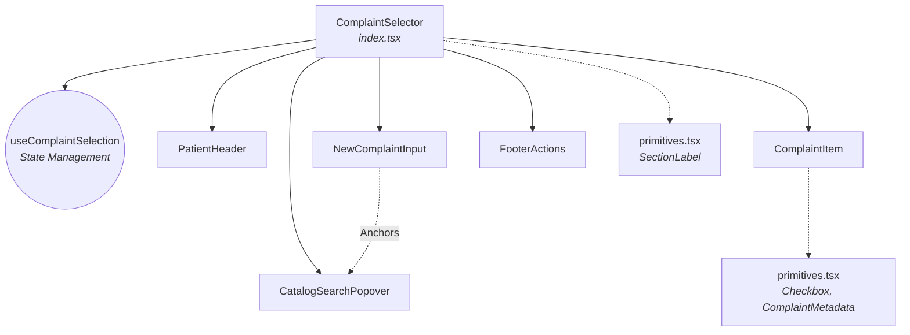

# Complaint Selector

## Title & Overview

The `ComplaintSelector` is a robust UI feature designed to manage and select patient medical complaints during clinical visits. It presents clinicians with an interactive checklist of a patient's existing active complaints and provides a powerful search mechanism to discover standard conditions from a predefined medical catalog (categorized by anatomical regions) or append custom free-text complaints. Built with high accessibility in mind, it supports seamless keyboard navigation, dynamic layout management via React portals, and centralized state orchestration for rapid data entry.

## Component Architecture

The feature is composed of cohesive, decoupled components orchestrated by a central container.

- **`ComplaintSelector` (`index.tsx`)**: The root container component. It coordinates complex layout states (such as popover visibility), intercepts keyboard navigation events, tracks catalog search filters, and manages scroll behaviors.
- **`useComplaintSelection` (`hook`)**: A custom React hook encapsulating the core state logic. It manages O(1) lookups for selected complaint IDs via Sets, handles custom appended complaints, and exposes atomic state operations (`add`, `remove`, `toggle`, `reset`).
- **`PatientHeader`**: A pure presentational component displaying patient demographics and visit history.
- **`NewComplaintInput`**: A text input field acting as the primary driver for catalog search queries and custom complaint entry. It forwards its DOM ref for popover anchoring and manages ARIA attributes for accessibility.
- **`CatalogSearchPopover`**: A portal-based overlay component rendering filtered search results and region filter chips. It dynamically calculates its absolute positioning relative to the `NewComplaintInput` anchor and responds to lifted keyboard navigation states.
- **`ComplaintItem`**: An interactive row component within the main checklist representing a single complaint. It displays condition metadata and allows toggling selection state or deleting dynamically-added custom complaints.
- **`FooterActions`**: Renders the "Cancel" and "Confirm" action buttons to commit or discard the selection state.
- **`primitives.tsx`**: A collection of reusable, low-level UI elements (`Checkbox`, `ComplaintMetadata`, `SectionLabel`).

### Component Tree

## State Management & Data Flow

The component enforces a unidirectional data flow by encapsulating business logic in a custom hook while hoisting interactive UI state to the parent to coordinate complex cross-component behaviors.

### Source of Truth (`useComplaintSelection`)
The core domain state is managed by the `useComplaintSelection` hook:
* **Active Selection**: `selectedIds` is maintained as a `Set<string>`, ensuring O(1) lookup performance during checklist rendering and toggle operations.
* **Custom Additions**: Items created via free-text or catalog selection are stored in `customComplaints`. 
* **Derived List**: The hook exposes `allComplaints`, a memoized combination of the patient's existing `availableComplaints` and new `customComplaints`, which acts as the data source for the scrollable checklist.

### Lifted State & Unified Keyboard Navigation
To achieve seamless keyboard accessibility, interactive state is lifted from `CatalogSearchPopover` to the parent `ComplaintSelector` (`index.tsx`):
* **Centralized Key Handling**: State like `focusedIndex` (list selection) and `selectedRegion` (filter chips) live in the parent. This allows a single `onKeyDown` handler attached to the `NewComplaintInput` to intercept `ArrowUp`/`ArrowDown`, `Enter`, and `Ctrl + ArrowLeft/Right` keys without complex event bubbling.
* **Inverted Data Flow**: While `CatalogSearchPopover` calculates the filtered results based on the search query and selected region, it passes the resulting array back to the parent via `onFilteredItemsChange`. The parent uses this array length to clamp the `focusedIndex` safely within bounds and resolve the correct item upon an `Enter` press.
* **Derived State Sync**: `index.tsx` utilizes a derived state pattern (`prevFilteredCatalogItems`) during render to reset `focusedIndex` to `0` whenever the filtered list changes. This avoids out-of-bounds focus errors and prevents stale state while circumventing the React `set-state-in-effect` warning.

## Key Architectural Decisions

*   **State Uplifting for Keyboard Navigation**: State such as `focusedIndex`, `filteredCatalogItems`, and `selectedRegion` is intentionally hoisted out of the `CatalogSearchPopover` and into the parent `ComplaintSelector` (`index.tsx`). This centralizes keyboard event interception inside the primary `<input>`'s `handleKeyDown` handler, ensuring seamless navigation (arrow keys, Enter, Ctrl+Arrow) without complex `ref` forwarding or focus management ping-pong.
*   **Derived State During Render**: To reset the `focusedIndex` when the catalog items mutate (e.g., from search filtering), we use derived state directly in the render phase (`filteredCatalogItems !== prevFilteredCatalogItems`) instead of a `useEffect`. This prevents staleness of the focused index, avoids cascading re-renders, and sidesteps `react-hooks/set-state-in-effect` anti-patterns.
*   **Portal-based Search Popover**: The `CatalogSearchPopover` uses `createPortal` to render at the `document.body` level. It uses `position: fixed` with viewport coordinates mapped via `getBoundingClientRect()`. This design guarantees it escapes `overflow: hidden`, `max-h`, or `z-index` stacking context constraints of ancestor components.
*   **Optimized Multi-Selection Workflow**: `handleCatalogSelect` clears the search query but deliberately keeps the popover open after a selection. While this requires the user to explicitly close the menu, it removes friction for power users adding multiple complaints in a single burst.
*   **O(1) Lookups for Active Complaints**: The `useComplaintSelection` hook uses a `Set<string>` for `selectedIds` rather than an array, prioritizing `O(1)` lookups over `O(n)` array operations (`.includes()`). Since selection status is queried on every render per list item, this prevents unnecessary CPU overhead.

## Edge Cases & Nuances

*   **Out-of-Bounds Array Clamping**: When typing actively filters down the list of catalog items, or changing regions abruptly shortens the list, `focusedIndex` could point out of bounds. We enforce a `safeFocusedIndex` compute (`Math.max(0, Math.min(focusedIndex, Math.max(0, filteredCatalogItems.length - 1)))`) that guarantees index safety regardless of how or why the list length changes.
*   **Structural Deep-Equality Guard in Popover**: In `CatalogSearchPopover`, the effect that bubbles `onFilteredItemsChange` up to the parent uses a `useRef` to track the *structural state* (ID-based comparison) of the list instead of referential equality. Without this guard, parent state updates would infinite-loop or fire on every keystroke, because `existingIds` is re-created as a new `Set` on every parent render cycle, breaking referential stability.
*   **Layout Paint Timeouts for Auto-Scrolling**: When a new custom complaint is appended to the list, we trigger a scroll to the bottom. We use a 50ms `setTimeout` delay inside the `useEffect`. This allows the browser enough time to finish layout calculations and paint the new item, ensuring `listContainerRef.current.scrollHeight` is strictly up-to-date and the item is scrolled fully into view.
*   **Preventing Focus Loss on Clicks**: The suggestion items and region chips inside the popover utilize `onMouseDown={(e) => e.preventDefault()}`. This intercepts the event before it bubbles, preventing the underlying primary `<input>` from losing focus (and firing `blur`) when interacting with the popover.
*   **Bypassing Input Focus Limitations**: Because browser focus events do not re-trigger on an element that is already focused, an explicit `onClick` handler is attached to the input to forcibly reopen the popover if a user clicks back into the active text box.
*   **React Compiler / ESLint Ref Quirks**: Inside `updateCoords`, the `anchorRef` is technically stable in memory, but because it is passed down as a prop, ESLint and the React Compiler cannot statically guarantee its stability. It is explicitly added to the `useCallback` dependency array to satisfy the compiler toolchain.
